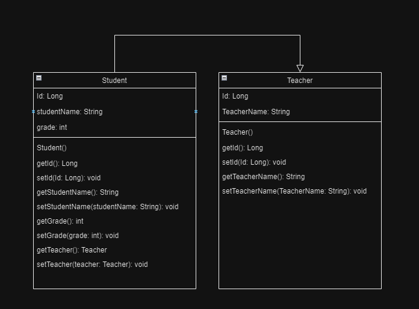

## https://github.com/ismailkarakayax/

---

## School App
#### Spring Boot - MySQL 
Spring Boot ve Mysql database ile oluşturulmuş bir School App (Okul Uygulaması). School App, öğrenci ve öğretmenlerin listesini databasede tutan database tablolarının birbiri ile ilişkili olduğu bir SpringBoot uygulamasıdır.

### Uml Class Diagram

---

### Requirements
    - Java 17
    - IntelliJ IDEA
    - MySQL
---

## Postman API Reference
#### Gets a list of all Students.
> **GET** => *"localhost:8080/api/student/getall"*
#### Gets a Student by ID.
> **GET** => *"localhost:8080/api/student/get/{id}"*
#### Gets a list of Students by Teacher ID.
> **GET** => *"localhost:8080/api/student/getbyteacherid/{id}"*
#### Creates a new Student.
> **POST** => *"localhost:8080/api/student/create"*
#### Updates a Student by ID.
> **PUT** => *"localhost:8080/api/student/put/{id}"*
#### Deletes a Student by ID.
> **DELETE** => *"localhost:8080/api/student/delete/{id}"* 

#### Gets a Teacher by ID.
> **GET** => *"localhost:8080/api/teacher/get/{id}"*
#### Gets a list of Teachers.
> **GET** => *"localhost:8080/api/teacher/getall"*
#### Creates a new Teacher.
> **POST** => *"localhost:8080/api/teacher/create"*
#### Updates a Teacher by ID.
> **PUT** => *"localhost:8080/api/teacher/put/{id}"*
#### Deletes a Teacher by ID.
> **DELETE** => *"localhost:8080/api/teacher/delete/{id}"*

---

## Tecnology
### Java
    
    - JavaSE
    - Spring Boot
    - Spring Framework
    - Spring MVC
    - Spring Data
    - Spring REST

---
## Database
    - MySQL

---
## Dependencies
    - Spring Web
    - Spring Data JPA
    - Lombok
    - MySQL
---

